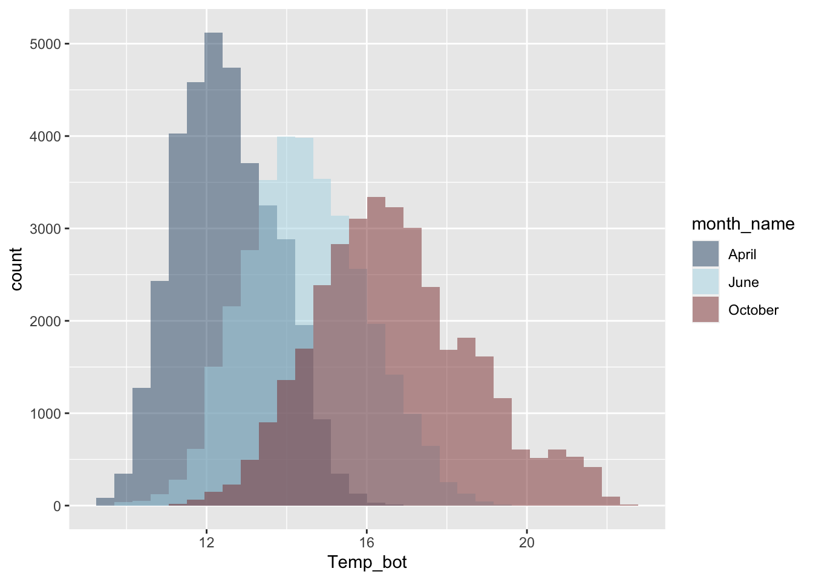
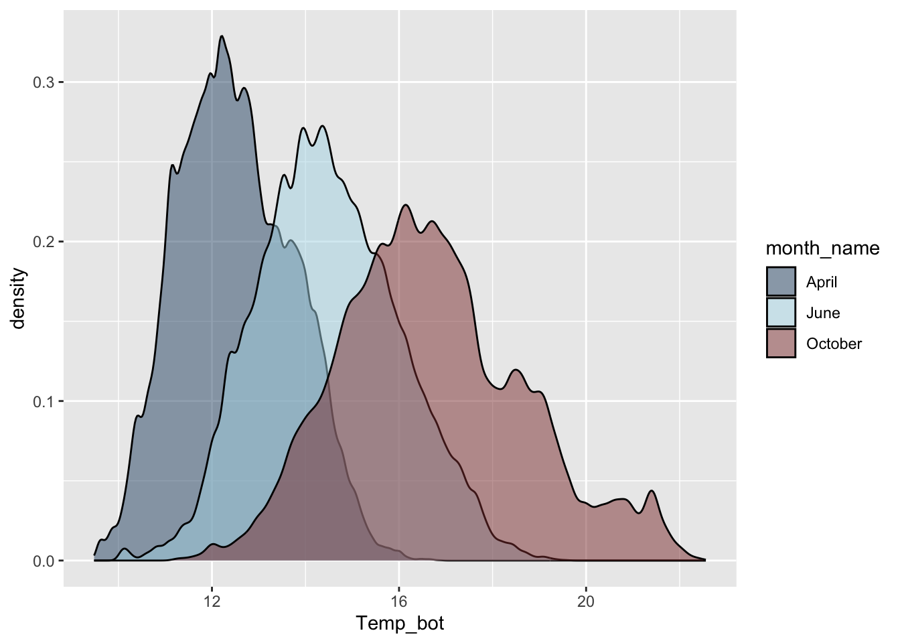
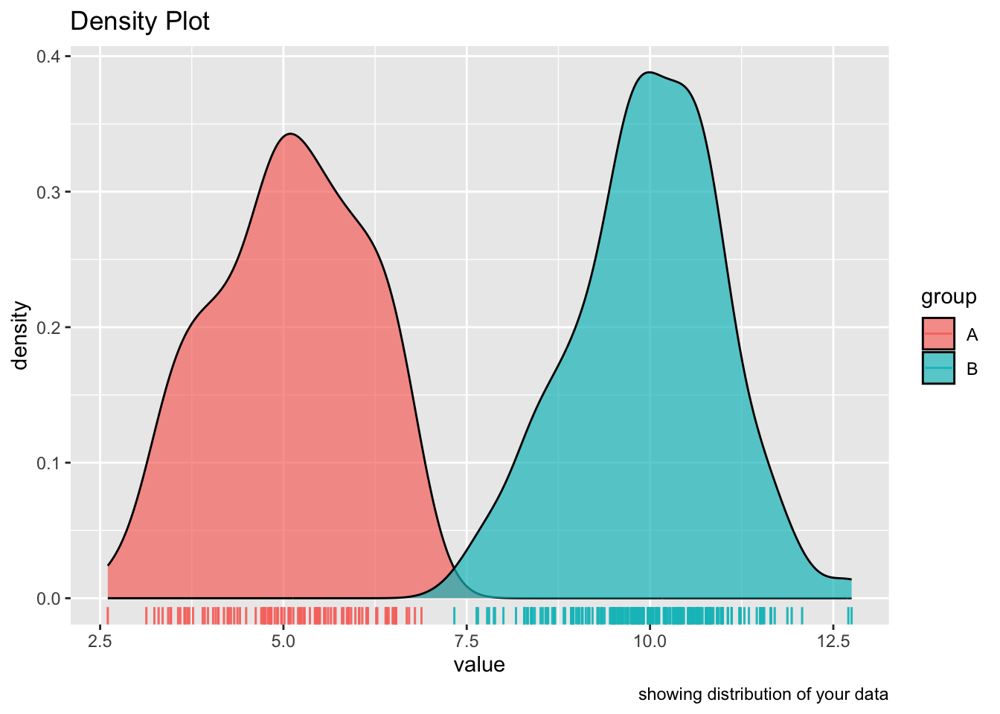
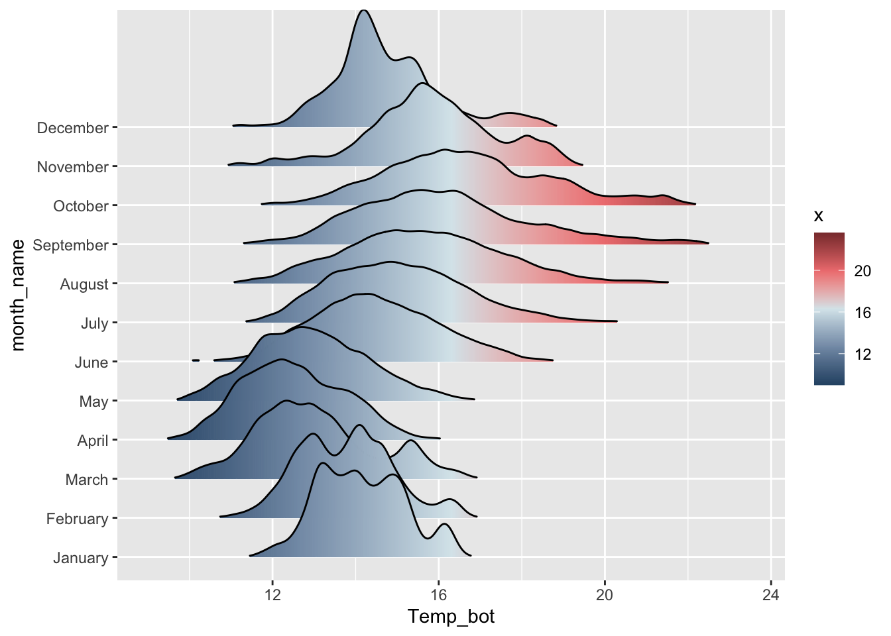
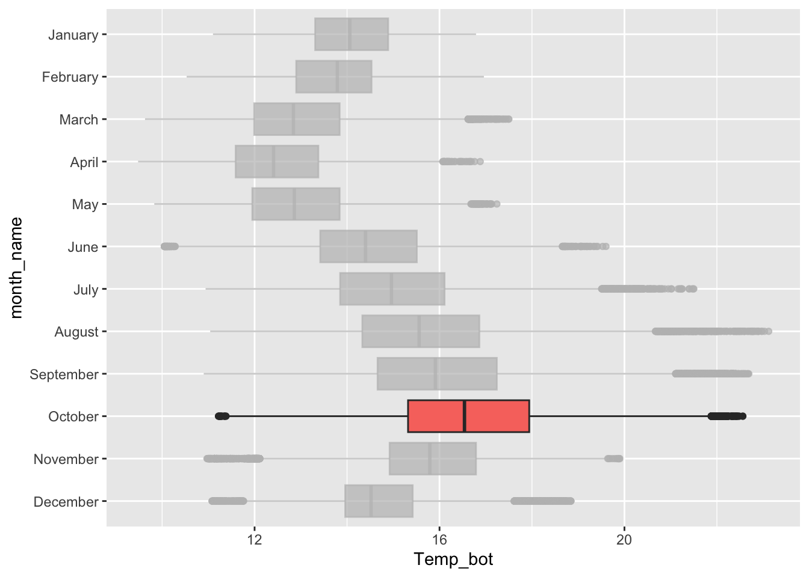
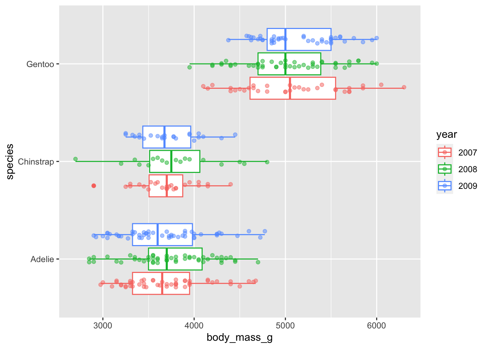
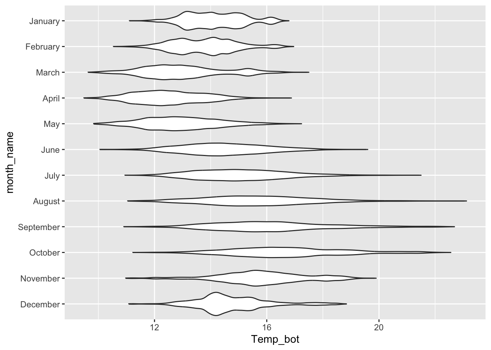

# 3.1 Choosing the Right Graphic Form

## Mapping Visuals

-   mapping - How values of a variable(s) of interest are represented by visuals
    -   e.g height of bar, shaded region of area plot, color of data points
-   Example - you want to compare unemployment rates of 5 countries: A, B, C, D, E (the actual values here are not important)
    -   bar graph ordered lowest to highest
    -   pie chart with labeled percentages
    -   map with color relating to unemployment rate
-   Hierarchy of elementary perceptual tasks
    -   based on paper published in 1984, that orders more easily distiguishable elements
        -   e.g. - hue and shade are at the bottom, meaning they're harder to understand quickly
    -   only considers statisyical charts
        -   on maps, hue and shading can be very important
-   notes

## Tips for Choosing Graphic Form

1.  **Think about the task(s) you want to enable or message(s) you want to convey.**

    a\. For example, do you want to compare, see change or flow, reveal relationships or connections, envision temporal or spatial patterns.


```{=html}
<!-- -->
```

2.  Consider the number of variables and the number of data points, as well as the data types you\'re working with.

    a\. For example, do you have several vs. many data points? How many categorical and/or numeric variables? Are your variables ordered or not ordered? Data types can dictate which graphical form is appropriate.

    b\. **data types** - continuous vs discrete, nominal vs. ordinal, vs. binary


```{=html}
<!-- -->
```

3.  Try different graphic forms, especially if you have more than one task to enable or message to convey.


```{=html}
<!-- -->
```

4.  Arrange the components of the graphic to make it as easy as possible to extract meaning from your graphic quickly.

    a\. e.g. - ordering bars in a chart

    b\. ordering will depend on the question your plot to answer


```{=html}
<!-- -->
```

5.  **Test the outcomes of your graphic on others,** particularly on those who are representative of the audience you are trying to reach.
6.  

## Critiquing Visuals

-   identify the primary and secondary insights that the graphic is trying to convey
-   Identify elementary perceptual tasks and what is confusing or difficult to do
    -   e.g. comparing lengths, angles
-   Identify if it\'s possible (*and* if it makes sense) to use more effective elementary perceptual tasks for the primary and secondary insights
-   Identify points of confusion and decide how those could be addressed
    -   e.g. a different graphic form, rearranging components, including an introduction graph, better annotation

# 3.2 Visualizing Distributions

## Introduction

-   distribution - the spread of a numeric variable(s)
-   key distribution plot types
    -   histograms
    -   density plots
    -   box plots
    -   ridge line plots
-   Note

## Case Study: Bottom Temperatures at Mohawk Reef

### Background 

-   using data from the Santa Barbara Coastal Long Term Ecological Research (SBC LTER)
-    data
    -   imported from the EDI data portal
-   Link [here](https://portal.edirepository.org/nis/mapbrowse?scope=knb-lter-sbc&identifier=2007)

### Data Wrangling

Additional wrangling steps are available on slide 5, lecture 3.2


::: {.cell}

```{.r .cell-code}
## ==== import libraries ===
library(tidyverse)
library(chron)
library(naniar)
library(palmerpenguins) #used later for plot examples

## === Read in data ===
mko <- read_csv("https://portal.edirepository.org/nis/dataviewer?packageid=knb-lter-sbc.2007.17&entityid=02629ecc08a536972dec021f662428aa")
```
:::

::: {.cell}

```{.r .cell-code}
## === Wrangling ===
mko_clean <- mko %>% 
  ## --- clean date/time columns ---
  # select desired columns
  select(year, month, day, decimal_time, Temp_bot) %>% 
  
  # combine yr, mo, and day columns into a single date column
  unite(date, year, month, day, sep = "-", remove = FALSE) %>% 
  
  # create a time column that's easier to interpret 
  mutate(time = chron::times(decimal_time)) %>% 
  
  # create combined date-time column
  unite(date_time, date, time, sep = " ") %>% 
  
  ## --- coerce data types ---
  # change date_time from character string to date-time object
  mutate(date_time = as.POSIXct(date_time, 
                                "%Y-%m-%d %H:%M:%S",
                                tz = "GMT"), # time zone
        # change year, month, date columns to factor 
         year = as.factor(year),
         month = as.factor(month),
         day = as.numeric(day)) %>% 
  
  ## --- add the month name ---
  # index the built-in `month.name` vector
  mutate(month_name = as.factor(month.name[month])) %>% 
  
  ## --- update NA values ---
  replace_with_na(replace = list(Temp_bot = 9999))
```
:::


### Histograms

-   represent the distribution of a numeric variable(s), which is cut into several bins
-   default for `ggplot` is 30 bins
    -   might want to adjust this, having too few/many bins can distort distributions
-   note


::: {.cell}

```{.r .cell-code}
## === Histograms ===
mko_clean %>% 
  
  ## --- additional wrangling for data viz ---
  # order the date to have the same order as month_name 
  mutate(month_name = factor(month_name, levels = month.name)) %>% 
  
  # filter so there are less months
  filter(month_name %in% c("April", "June", "October")) %>% 
  
  ## --- create the histogram ---
  # create baseplot, selecting variable and fill color
  ggplot(aes(x = Temp_bot, fill = month_name)) +
  
  # change position to identity so that it's the true distribution, try changing this back to the default `stack` to see differences
  geom_histogram(position = 'identity',alpha = 0.5, bindwidth = 1) +
  
  # customize colors
  scale_fill_manual(values = c("#2C5374", "#ADD8E6", "#8B3A3A"))
```

::: {.cell-output-display}
{width=672}
:::
:::


### Important Considerations

-   useful when you want to visualize the shape of your data (not affected by bin number)
-   does not indicate sample size
-   can be misleading with small data sets
-   band width, which affects level of smoothing

### 

## Density Plots

-   smoothed version of a histogram
-   representation og the distributions of a numeric variable(s), which uses a kernel density estimate (KDE) to show the probability density function of the variable
-   area under the curve equals 1
-   good option when you're concerned with the shape of the distribution

### in `ggplot`


::: {.cell}

```{.r .cell-code}
mko_clean %>% 
  filter(month_name %in% c("April", "June", "October")) %>% 
  ggplot(aes(x = Temp_bot, fill = month_name)) +
  geom_density(alpha = 0.5, adjust = 1/2) + 
  scale_fill_manual(values = c("#2C5374", "#ADD8E6", "#8B3A3A"))
```

::: {.cell-output-display}
{width=672}
:::
:::


### important considerations

-   useful when you want to visualize the shape of your data (not affected by bin number)
-   does not indicate sample size
-   can be misleading with small data sets
-   band width, which affects level of smoothing

### Histograms vs. Density Plots

-   histograms - show us the ***counts*** (frequency) of values in each range (bin), represented by the height of the bars

-   density plots - show the ***proportion*** of values in each range

    -   area under the curve equal 1

    -   peaks indicate where more values are concentrated, but it does *not* tell us anything about the *the number* of observations

-   Example - use dummy data to visualize the differences


    ::: {.cell}
    
    ```{.r .cell-code}
    ## === Create dummy data ===
    dummy_data <- data.frame(value = c(rnorm(n = 100, mean = 5),
                                       rnorm(n = 200, mean = 10)),
                             group = rep(c("A", "B"),
                                         times = c(100, 200)))
    
    ## === Create histogram ===
    ggplot(dummy_data, aes(x = value, fill = group)) +
      geom_histogram(position = 'identity', alpha = 0.7) +
      geom_rug(aes(color = group), alpha = 0.75) +
      labs(title = "Histogram",
           caption = "showing distribution of data and sample size")
    ```
    
    ::: {.cell-output-display}
    {width=672}
    :::
    
    ```{.r .cell-code}
    ## == Create density plot ===
    ggplot(dummy_data, aes(x = value, fill = group)) +
      geom_density(alpha = 0.7) +
      geom_rug(aes(color = group), alpha = 0.75) +
      geom_rug(aes(color = group), alpha = 0.75) +
      labs(title = "Density Plot",
           caption = "showing distribution of your data")
    ```
    
    ::: {.cell-output-display}
    {width=672}
    :::
    :::


### Scaled Density Plots

-   In a scaled density plot, the area under the curve reflects the number of observations for each group
-   We can use scaled density plots to compare individual group distributions to the total distribution

## Ridgeline Plots

-   Ridgeline plots show the **distribution of a *numeric* variable** for **multiple groups**

-   considerations

    -   work best when you have \> 6 groups


    ```{=html}
    <!-- -->
    ```

    -   works well when there is a clear pattern in the result (e.g. if there is an obvious ranking in groups) and / or when visualizing changes in distributions over time or space

-   need a numeric variable with lots of values

-   `ggridges` has a number of different geoms for creating ridgeline plots

### Example - creating ridgeline plots using `ggridges`


::: {.cell}

```{.r .cell-code}
# create the base plot
ggplot(mko_clean, aes(x = Temp_bot, y = month_name, 
                      fill = after_stat(x))) +
  
  # add the ridges geom, use rel_min_height to adjust tail
  ggridges::geom_density_ridges_gradient(rel_min_height = 0.01,
                                         scale=3) +
  
  # reorganize by month name
  scale_y_discrete(limits = month.name) +
  
  # customize colors, these aren't necessary but they support the values on the x-axis 
  scale_fill_gradientn(colors = c("#2C5374","#849BB4", "#D9E7EC",
                                  "#EF8080", "#8B3A3A"))
```

::: {.cell-output-display}
{width=672}
:::
:::


## Additional Distribution Plots

### Box plots

-   summarize the distribution of a numeric variable for one or several groups

-   considerations

    -   box plots *summarize* data, meaning we can\'t see the underlying shape of the distribution or sample size


    ```{=html}
    <!-- -->
    ```

    -   add jittered points on top, or if large sample size, consider a violin plots

-   notes


::: {.cell}

```{.r .cell-code}
ggplot(mko_clean, aes(x = month_name, y = Temp_bot, 
                      fill = month_name)) +
  geom_boxplot() + 
  
  #rev() reverses order of month name 
  scale_x_discrete(limits = rev(month.name)) +
  coord_flip() +
  
  # highlight one month w
  gghighlight::gghighlight(month_name == "October") +
  
  # remove legend
  theme(legend.position = "none")
```

::: {.cell-output-display}
{width=672}
:::
:::

::: {.cell}

```{.r .cell-code}
penguins %>% 
  mutate(year = as.factor(year)) %>% 
  ggplot(aes(x = species, y = body_mass_g, color = year)) +
  geom_boxplot() +
  geom_point(alpha = 0.5, 
             position = position_jitterdodge(jitter.width = 0.2)) +
  coord_flip()
```

::: {.cell-output-display}
{width=672}
:::
:::


### Violin Plots

-   visualize the **distribution of a numeric variable for one or several groups**, where the shape of the violin represents the density estimate of the variable (i.e. the more data points in a specific range, the larger the violin is for that range). They provide more information about the underlying distribution than a box plot.

-   considerations

    -   ordering groups by median value can make it easier to understand


    ```{=html}
    <!-- -->
    ```

    -   show sample size when comparing groups with very different distributions (e.g. half violin plot)

-   great for multiple groups


::: {.cell}

```{.r .cell-code}
ggplot(mko_clean, aes(x = month_name, y = Temp_bot)) +
  geom_violin() +
  scale_x_discrete(limits = rev(month.name)) +
  coord_flip()
```

::: {.cell-output-display}
{width=672}
:::
:::


can add a boxplot to include summary statistics by adding a boxplot to the violin


::: {.cell}

```{.r .cell-code}
ggplot(mko_clean, aes(x = month_name, y = Temp_bot)) +
  geom_violin() +
  geom_boxplot(color = 'gray', alpha = 0.5, width = 0.1) +
  scale_x_discrete(limits = rev(month.name)) +
  coord_flip()
```

::: {.cell-output-display}
{width=672}
:::
:::


Can create a plot that's 1/2 violin, and 1/2 boxplot


::: {.cell}

```{.r .cell-code}
ggplot(penguins, aes(x = species, y = bill_length_mm, fill = species)) +
  see::geom_violindot(size_dots = 5, alpha = 0.5) +
  theme(legend.position = "none")
```

::: {.cell-output .cell-output-stderr}
```
Warning: Removed 2 rows containing non-finite values (`stat_ydensity()`).
```
:::

::: {.cell-output .cell-output-stderr}
```
Warning: Removed 2 rows containing missing values (`stat_bindot()`).
```
:::

::: {.cell-output-display}
{width=672}
:::
:::

